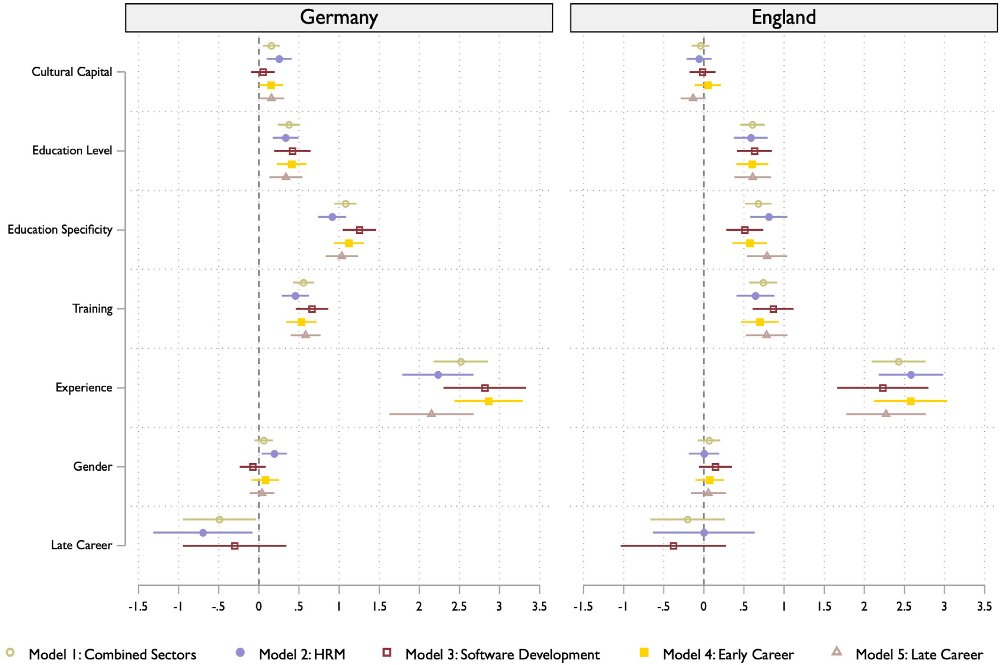
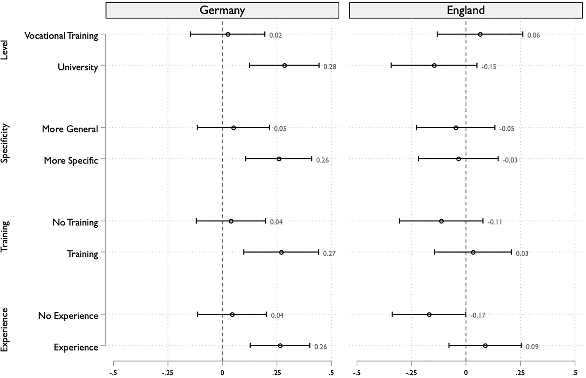
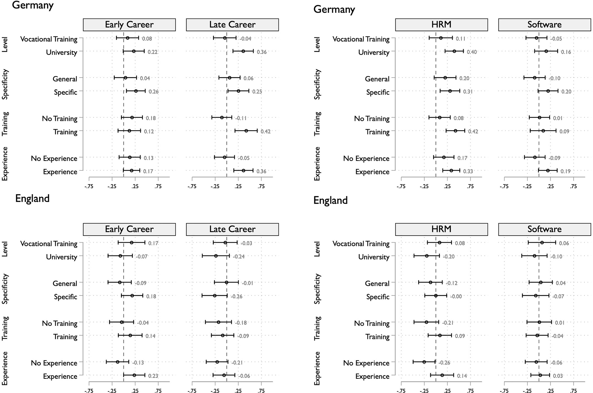

## 問い

- 採用は**ゲートキーピング**の場であり，労働市場の不平等生成の鍵 (Bills et al. 2017; Rivera 2020)
- 採用担当者は人的資本だけでなく**文化資本シグナル**にも依拠
- 先行研究は両者を**別々に**扱ってきた

**RQ：採用担当者は，異なる人的資本シグナルのもとで，文化資本シグナルをどう評価するのか？**

- 鍵は両者の **交互作用**——エリート職以外でこそ重要に なりうる

## 文化資本シグナル

- 文化資本とは「正統な知識・技能・趣味の所有」
- 文化資本シグナルは現在の階級的位置と出身階級を結びつける
- 採用プロセスでは **名前・余暇活動・学歴・応募書類の美的要素** などから観察可能
- ハイブラウなシグナルは二重に作用
  - 社会空間への**位置づけ**
  - **ステレオタイプの喚起**（有能さ・洗練・規律，ときに冷たさ・傲慢さも）

## シグナルの文脈依存性

- 文化資本シグナルは**普遍的通貨ではない** (Erickson 1996)
- 価値を左右する要因
  - **ジェンダー**（ステレオタイプの内容が変わる）
  - **界**（評価のされ方が異なる）——cultural matching
  - **労働者理想像**（例：ソフトウェアの「オタクの若い男性」，金融の「上流階級の男性」）
- とくに**知識の曖昧性**が高く，**対面性**が強い職種で洗練（polish）の価値が増幅

## 文化資本と人的資本の相互作用

階層研究の2つのメカニズム

::: {.columns}
::: {.column width="50%"}
**乗算（multiplication）**

- 高文化資本は**高人的資本があって初めて**報われる
- Reeves & De Vries (2019)：文化的消費の便益は**大卒者のみ**
:::
::: {.column width="50%"}
**補償（compensation）**

- 文化資本が**人的資本の不足・曖昧さを埋める**
- Fossati et al. (2020)：親の上流職が訓練市場のシグナル不足を補償
:::
:::

<!-- → 本研究はこの**交互作用の方向**をフィールド横断で検証 -->

## 社会移動のシグナル

- 文化資本と人的資本の組み合わせは**移動パターン**を示唆しうる
- 上昇移動（低い出身 × 高い人的資本）
  - 「期待以上の達成」→ 有能・勤勉と評価される可能性（メリトクラティックな物語）
- 下降移動（上流の出身 × 低い人的資本）
  - 階級規範からの逸脱として**ペナルティ**を受ける可能性
- メリトクラシー信念の強い社会で顕著になりうる

## コンテクスト①：キャリア段階

- 早期キャリア（約25歳）／後期キャリア（約55歳）
- Friedman & Laurison (2020)：キャリアが進むほど**出身階級の重要性が増す**
- 後期キャリア：**拡張された役割**・地位期待・勤続年数
  - → 文化資本シグナルがより大きな役割を持ちうる
- 一方で高齢労働者には「訓練可能性が低い」というステレオタイプ

## コンテクスト②：セクター

ともに**中間層の知識労働**／資格・免許要件なし → 交互作用を観察するための **most-likely case**

::: {.columns}
::: {.column width="50%"}
**ソフトウェア開発**

- 「オタクの若い男性」像
- 技能・専門性の評価基準が**明確**
- 文化資本の役割は**小さい**と予想
:::
::: {.column width="50%"}
**人事（HRM）**

- 女性中心 + 管理職的伝統
- 知識基準が**曖昧**，対面性が高い
- 文化資本の役割は**大きい**と予想
:::
:::

## コンテクスト③：国

- **ドイツ**：雇用主が教育課程に関与，**職業的資格**が高評価．資格と「スキルがあること」が結びつく
  - → 文化資本は人的資本と**交互作用をもちにくい**かも
- **イングランド**：職場で技能を学ぶ，**学習意欲・能力**が重視される
- 階級アイデンティティ
  - イングランド：多くが労働者階級を自認 → 階級を**控えめに**表現
  - ドイツ：中間層の自認が最多
- ※ 主目的は比較ではなく，交互作用がいかに文脈依存かを示すこと

## 方法：要因配置実験

- 採用者が**架空候補者のヴィネット**を評価
- 複数の属性を**同時に重みづけ**→ 評価過程の検証に適合，社会的望ましさバイアスを低減
- **観察データでは分離困難**な文化資本／人的資本シグナルを独立に操作可能
- **従属変数**：採用の見込み（0–10）
- **ランダム切片モデル**，ヴィネットセットを統制
- 分析単位は**ヴィネット**（N = 回答者 × 8）

## ヴィネットの7次元（Table 1）

| 次元 | 水準 |
|---|---|
| 文化資本 | 低／高 |
| キャリア段階 | 早期／後期（**回答者間**で変動） |
| 教育レベル | 職業訓練／大学 |
| 教育の専門性 | 一般的な分野／職種に密接に関連した専門分野 |
| 訓練参加 | 記載なし／直近1年に職種に関連した集中訓練 |
| 職務経験 | 隣接分野・他社／同職種・同社 |
| ジェンダー | 男性／女性 |

- 64ヴィネット（26），state-of-the-art D-efficient design (lol) で8ブロック×8に分割

## 文化資本の操作化（Table 2）

- **名前 ＋ 余暇活動**の組み合わせ（一貫）
- 「友人と」を付加し**社交性を統制**

| | 低文化資本 | 高文化資本 |
|---|---|---|
| 余暇例 | TV，ジム，カントリー／シュラーガー音楽，サッカー観戦，ランニング／サイクリング，ダーツ | ゴルフ，劇場，クラシック音楽，セーリング，テニス，美術館 |
| 名前（ドイツ）| Justin, Kevin, Chantal … | Ferdinand, Konstantin, Charlotte … |
| 名前（イングランド） | Wayne, Sharon, Chantelle … | Rupert, Arabella, Penelope … |

<!-- → 明確なハイブラウ vs「平凡」 -->

## サンプリングとデータ

- 直近12か月に当該分野で**採用経験のある者**
- 調査時期：2024年5–9月

| | 募集方法 | HRM | ソフトウェア |
|---|---|---|---|
| ドイツ | 求人広告のメール（連邦雇用エージェンシー） | 99 | 94 |
| イングランド | LinkedIn ＋ Prolific | 96 | 75 |

- 国によって**サンプリング方法が大きく異なる**点に留意

## 推定

- **主効果**：国別モデル（セクター・キャリアを統制）→ セクター別 → 早期／後期別
- **交互作用**：文化資本 × 人的資本 {教育レベル・専門性・訓練・職務経験}
- 多重検定による**第1種の過誤**を抑えるため
  - まず**結合Wald検定**で4つの交互作用が「まとめて」0と異なるか検定
  - **結合検定が有意な場合のみ**個別交互作用を解釈する方針
- 文化資本の**限界効果**を人的資本水準ごとに算出

<!-- ## 結果①：記述統計（Table 5）

採用見込み（0–10）の平均：5.4〜6.2，SDは2.6〜2.7で安定

| コンテクスト | DE 平均 | DE SD | EN 平均 | EN SD |
|---|---|---|---|---|
| 結合 | 5.6 | 2.7 | 5.8 | 2.6 |
| HRM | 5.9 | 2.6 | 5.5 | 2.7 |
| ソフトウェア | 5.4 | 2.8 | 6.2 | 2.6 |
| 早期 | 5.9 | 2.7 | 6.0 | 2.7 |
| 後期 | 5.4 | 2.7 | 5.7 | 2.6 |

- 最低：DEの後期・DEソフトウェア／最高：ENソフトウェア -->

## 主効果

{fig-align="center" width="80%"}

## 主効果

- **多くのコンテクストで文化資本シグナルは有利に働かない**
- **イングランド**：両分野でほぼゼロ（HR −0.06，ソフトウェア −0.02）
- **ドイツ**：平均では正に効くが…
  - ソフトウェア = ゼロ，**HRMで顕著（+0.25，5.78→6.04）**
- **人的資本は全コンテクストで評価される**
  - とくに**職務経験**，ドイツでは**教育の専門性**が高評価

## 交互作用｜国別

ドイツのみ結合検定が有意（**p = 0.008**）→ **乗算パターン**

{fig-align="center" width="80%"}

ドイツでは**高い人的資本のときだけ**文化資本が正に効く（乗算）．イングランドは概ねゼロ近傍．

## 交互作用｜国・キャリア・セクター別

{fig-align="center" width="80%"}

## 結果④：コンテクスト別の交互作用（Table 4）

結合Wald検定（χ²(4)，太字 = p < 0.05）

| コンテクスト | モデル | DE χ² | DE p | EN χ² | EN p |
|---|---|---|---|---|---|
| 結合 | 6 | 13.68 | **0.008** | 6.47 | 0.167 |
| 早期キャリア | 9 | 9.02 | 0.061 | 7.85 | 0.097 |
| 後期キャリア | 10 | 7.53 | 0.110 | 1.17 | 0.884 |
| HRM | 7 | 2.30 | 0.680 | 6.77 | 0.148 |
| ソフトウェア | 8 | 18.53 | **0.001** | 2.97 | 0.562 |

- 本文の主張：**ドイツ後期キャリアで乗算が最も明確**（大学 +0.40／訓練 +0.53／経験 +0.41）
- イングランド：4コンテクストいずれも結合効果なし（個別ではHRM・早期で経験との交互作用のみ）

## 考察・結論

RQへの答えは**二層構造**

1. 研究対象のフィールドでは，採用者は**そもそも文化資本シグナルにあまり依拠しない**（とくにイングランド）
2. 依拠する場合，**人的資本シグナルが文化資本の価値の「必要条件」**として働く（乗算）

- 便益は**乗算ではなく組み合わせ**から生じる → 文化資本の価値は「活性化」を要する
- Reeves & De Vries (2019)（大卒のみ便益）と整合
- 文化資本は「不確実性下の判断材料」ではなく，**有能な候補者間の差別化装置**として機能
- **補償・移動パターンの評価**は支持されず（相殺の可能性も）

## 限界

- **概念化**：名前（出身）と趣味を**固定的に結合**→ 両者を分離できない（第一世代学生等の明示で移動を前景化できた）
- **社会的望ましさ**：ドイツでは過小推定の可能性，イングランドでは望ましさに沿う回答の可能性
- **サンプリング**：低回収率，国間で手法が異なる（Prolific使用）
- **検定力**：交互作用で小さな効果を検出できない可能性（第2種の過誤）
- **一般化可能性**：2つの産業に限定 → ブルーカラーや出身強調デザインが今後の課題

## 報告者からの論点

1. **本文とTable 4の不整合（要確認）**
   - 本文：後期キャリアで乗算が最明確／HRM p=.06／ソフトウェア非有意
   - Table 4：後期 p=.110（非有意），HRM p=.680，**ソフトウェア p=.001**
   - 「結合検定が有意な場合のみ個別交互作用を解釈」という**自身の方針との整合性**は？
2. **保守的操作化の代償** — 「平凡な」下位中間層は真の労働者階級ではない．乗算は「差別化」解釈と整合的か
3. **外的妥当性** — ヴィネット評価 vs 監査研究（実際の応募）．「採用見込み」の妥当性
4. **null をどう読むか** — 主効果も交互作用も乏しいイングランド：理論的含意か，検定力の問題か

## 

::: {style="text-align:center; margin-top:1.5em;"}
ご清聴ありがとうございました

<small>Burchartz, L., De Keere, K., & Geven, S. (2026). 
"Cultural and Human Capital Signals in Hiring—A Factorial Survey Experiment Across Contexts." 
*The British Journal of Sociology.* https://doi.org/10.1111/1468-4446.70125</small>
:::