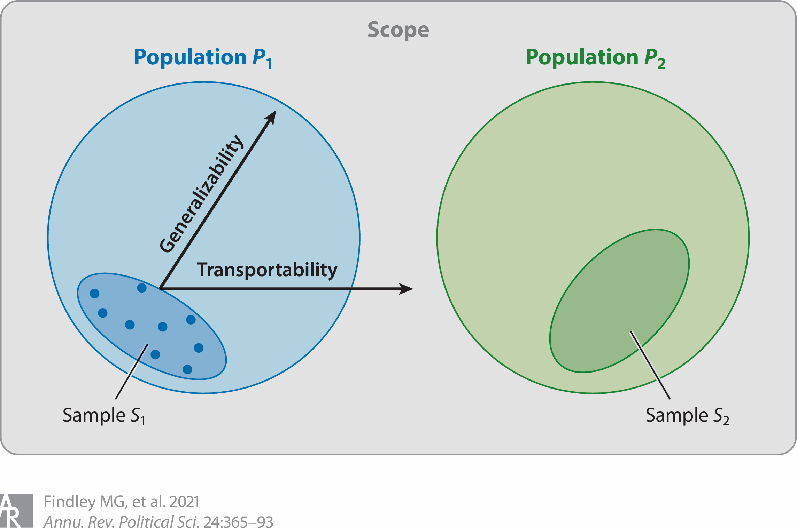

# Introduction

## 内的妥当性という「ウサギの穴」

### 信頼性革命（credibility revolution）
- デザインベースの因果推論
- **内的妥当性**（internal validity）の進歩

### 外的妥当性（external validity）の軽視
- 一方で，結果を外部にどう適用できるかが不明確
- 目の前のデータを超えた**推論**（inference）こそが，社会科学を歴史学などの記述的（idiographic）学問と分かつ

## 論文の目的

1. 外的妥当性を内的妥当性の「対等なパートナー」にする
2. **一般化可能性**と**移転可能性**の区別，**M-STOUT**フレームワークの提示
3. 外的妥当性を評価するための3つの基準の提示：
    
    モデルの有用性，スコープの妥当性，特定の信頼性

# What Is External Validity?

## 妥当性（validity）

- 推論の近似的な真実らしさや有用性
- 理論やデザインそのものの属性ではなく，**特定の研究から得られた推論の属性**

## 内的妥当性（internal validity）

- その研究の標本において，推論（因果関係の識別）がどの程度正しいか

::: {.indent-1}
**統計的結論の妥当性**（statistical conclusion validity）

- 因果関係があるか，それが一般化できるかを評価するための統計的手法の適切さ
:::

## 外的妥当性（external validity）

- ある研究の標本から得られた推論が，より広い母集団やほかの目標母集団にどの程度適用できるか

::: {.indent-1}
**構成概念妥当性**（construct validity）

- 変数が理論的概念と対応するように操作化されているか
:::

## スコープ，母集団，標本

{fig-align="center" width="80%"}

## スコープ，母集団，標本

::: {.bullet}
- **スコープ**（scope）
  
    理論や議論の適用可能性と限界
- **母集団**（population）
  - 理論的母集団（theoretical population）
  
    メカニズムが適用されると想定される抽象的な対象群
  - アクセス可能な母集団（accessible population）
  
    実際に標本抽出枠として利用可能な対象群
:::

## 一般化可能性と移転可能性

### 一般化可能性（generalizability）

- ある標本にもとづいた推論が，その標本の母集団に適用できるか
- $S \subseteq P$

### 移転可能性（transportability）

- ある標本にもとづいた推論が，異なる母集団に適用できるか
- $S \not\subseteq P$
- 一般的に，移転可能性のほうが実証的なハードルが高い

## M–STOUTフレームワーク

従来のUTOS（units, treatments, outcomes, settings）にメカニズム（M）と時間（T）を追加

- **M (mechanisms / メカニズム)**

  因果関係がSTOUTのあいだをどのように機能するか
  
  （狭義では，処置とアウトカムをつなぐ媒介要因）

- **S (settings / セッティング)**

  実験室，国，村など，データが生成された環境

- **T (treatments / 処置)**

  独立変数の操作化

- **O (outcomes / アウトカム)**

  従属変数の操作化

- **U (units / ユニット)**

  個人，世帯，国家などの分析単位

- **T (time / 時間)**

  過去の知見が未来の状態に適用できるか

# Why Does External Validity Matter?

## バイアスの等価性

- 内的妥当性が外的妥当性よりも重要であるという理由はない
- 外的妥当性を無視することは，内的妥当性（因果推論）を無視するのと同様に，推論に深刻なバイアスをもたらしうる

## 群間平均差の分解

$$
\begin{align*}
\hat{\delta}_S = \delta_P + b_{S1} + b_{S2} + b_P + b_V
\end{align*}
$$

- $\hat{\delta}_S$: 標本における群間平均差推定量
- $\delta_P$: 母集団における処置効果（PATE for 一般化可能性，TATE for 移転可能性）
- $b_{S1}$: 処置割当への選択バイアス
- $b_{S2}$: 標本での処置効果の異質性
- $b_P$: 標本への選択バイアス
- $b_V$: 変数の選択バイアス

## 内的妥当性によるバイアス

- $b_{S1}$: 処置の無作為割当ができないとき
- $b_{S2}$: 処置効果が処置群と統制群で異なるとき

逆に言えば，$b_{S1} = b_{S2} = 0$ であれば内的に妥当であり，標本平均処置効果（SATE）が不偏推定される

## 外的妥当性によるバイアス

- $b_P$: 標本に含まれたユニットと，除外されたユニットのあいだでの処置効果の差

::: {.indent-1}
settings (S), units (U), and time (T)
:::

- $b_V$: 理論的な変数と手持ちの変数との乖離

::: {.indent-1}
関心のある変数のPATE/TATE と 手持ちの変数のPATE/TATE の差

treatments (T) and outcomes (O)
:::

## 実験研究 vs. 観察研究のトレードオフ

完璧な実験研究（内的妥当性↑／外的妥当性↓）

- 無作為割当により $b_{S1} = b_{S2} = 0$ となるが，非代表的なサンプルによる $b_P$ や $b_V$ のバイアスが残る
- 標本内の効果（SATE）が正しくとれていても，母集団の効果（PATE）からは程遠い可能性がある

代表性のある観察研究（内的妥当性↓／外的妥当性↑）

- 無作為抽出により $b_P = b_V = 0$ に近づくが，非無作為な割当による $b_{S1}$ や $b_{S2}$ が残る

どちらがより母集団の真の値（PATE）に近い推定値を出せるかはケースバイケースであり，**実験が常に優位であるとは限らない**

## なぜ外的妥当性を無視できないのか

- **科学的・政策的リスク**
  特定のサンプルで効果を最大化するように設計された実験結果を，無批判に広域へ適用（一般化）することは，公共政策の失敗を招く可能性がある
- **社会科学の本来の目的**
  - 「因果関係が特定できなければ，なぜ外的妥当性を気にするのか？」という問いに対し，著者は**「外的妥当性が分からなければ，なぜ因果関係（特定の結果）を気にするのか？」**と問い返す
  - 目の前のデータを超えた「一般化された知識」の生産こそが科学の責務である

# Toward Evaluative Criteria for External Validity

## 3つの評価基準
1. **モデルの有用性 (Model utility)**

::: {.indent-1}
標本または研究の統合から導き出される推論を体系化するモデルの有用性
:::

2. **スコープの妥当性 (Scope plausibility)**

::: {.indent-1}
研究の標本次元およびそれに対応する母集団が，どの程度妥当に選定・構築されているか
:::

3. **特定の信頼性 (Specification credibility)**

::: {.indent-1}
理論的および実証的手法が，関心のある理論的母集団に関する根拠のある推論をどの程度提供しているか
:::

## モデルの有用性

### 要素1｜点推定値からメカニズムへ
::: {.indent-4}
メカニズムがほかの文脈でも機能するかを問うべき
:::

### 要素2｜メカニズムの特定による因果原理の明示
::: {.indent-4}
とくに**INUS**条件（それ自体は不十分だが，ある十分な条件の一部として必要な条件）が重要
:::

### 要素3｜抽象化のレベル
::: {.indent-4}
メカニズムをどの程度の抽象度でとらえるかが，ほかの事例への移転可能性を左右
:::

## スコープの妥当性

### 要素1｜母集団の明確化
::: {.indent-4}
理論的な母集団と，実際にアクセス可能な母集団を，STOUTの全次元において事前に定義
:::

### 要素2｜メカニズムと文脈の相互作用
::: {.indent-4}
MがSTOUTの各次元とどう相互作用するか，文脈依存性の有無
:::

### 要素3｜サンプリングの原則
::: {.bullet .indent-4}
- 無作為
- あたかも無作為
- 層化無作為 → 重み付けや事後層化
:::

### 要素4｜理論にもとづいた非無作為抽出
::: {.indent-4}
:::

## 特定の信頼性

### 要素1｜理論とデザインによる反証可能性
::: {.indent-4}
理論とデザインにもとづく反証可能な基準の設定
:::

### 要素2｜仮定の正当性
::: {.indent-4}
DAG，構造モデル，重み付けの仮定
:::

### 要素3｜推定対象（estimand）の整合性
::: {.indent-4}
PATE/TATE ↔ SATE ↔ 研究から得られる推定対象との乖離
:::

### 要素4｜理論にもとづいた研究の統合
::: {.indent-4}
メタ分析で，M-STOUTのどの部分の変動を使うか
:::

# Reporting

## 「外的妥当性」専用セクションの義務化

::: {.bullet}
- 内的妥当性に関しては厳格な報告基準があるが，外的妥当性は無視されるか，記述が表層的
- **論文の提言：全ての論文に専用の議論セクションを**
  - 外的妥当性の議論を義務にすべき
  - たんに「どこに適用できるか」だけでなく，「**どのような条件下では適用できないか**」を明示
- **報告すべき具体的なチェックリスト**
    1.  **M–STOUTの全次元**
    2.  **母集団の定義**：理論的母集団，アクセス可能な母集団，サンプルの関係を明確にする
    3.  **推論の性質**：その推論が一般化可能性を狙ったものか，移転可能性を狙ったものなのかを明示
:::

# Conclusion

## 社会科学の究極の目標に向けて

::: {.bullet}
- 外的妥当性はたんなる「おまけ」や後知恵ではなく，社会科学における**認識論的・方法論的な根幹**
- 大規模サンプルやビッグデータの利用が，直ちに外的妥当性を保証するわけではない
- 知の蓄積に向けた体系的な評価
  - 著者，査読者，編集者が一体となり，外的妥当性について議論すべき
  - 結果がどの母集団に一般化可能か，あるいは移転可能かを体系的に評価することで，科学的知識の蓄積が実現する
:::